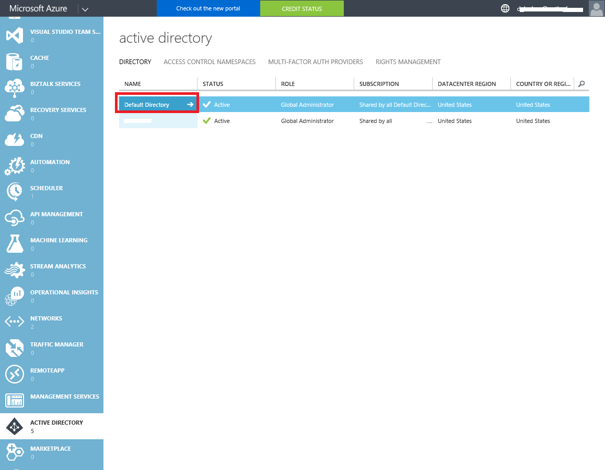

# How to authenticate Azure Rest API with Azure Service Principal by Powershell

## Introduction
This script demonstrates how to call Azure management rest API by Powershell. You should pass the azure application client id, secret key and tenant id to the script. And change the rest URI properly in order to fulfill your requirement. To find out how to obtain those ids and secret keys, please read the prerequisite section of this document.

## Scenarios
Microsoft exposes Rest Azure Management API. IT admin can call them to manage their Azure resources.

Basically, IT admin can call Azure Resource Management Powershell cmdlet to do the same things. However, the Rest APIs are more often the first class comparing to Powershell cmdlets, especially for new features of Azure. And you can call Rest API by providing security information in advance, which means that you will not need to input your username and password manually. It is very suitable for running scripts within daemon service environment.

## Prerequisites
Before running the script, you should create an application in your default Azure AD, and obtain **client id, secret key and tenant id** for it. Please follow the steps listed below.

## Client Id & Secret Key
- Login the Azure classic portal [https://manage.windowsazure.com ](https://manage.windowsazure.com) by ADMIN account
- Navigate to the “Active Directory” on the left pane

- Go to the default directory

- Go to applications tab in default directory and click “Add” button at bottom

- Select “Add an application my organization is developing”

- Input the application name and select “WEB APPLICATION AND/OR WEB API” as the type

- Fill in SIGN-ON URL and APP ID URI. What I input here are all [https://localhost](https://localhost)

- After having successfully created the App , open it and navigate to the CONFIGURE tab

- Create access key and copy client Id of this application, the **access key can be shown after saving**

- Go to the bottom of the page and find “Permissons to other applications”, click “Add application” button

- Add “Windows Azure Service Management API”

- Go back to “Permissons to other applications” section in configure page and check the “Delegated Permissons” for “Windows Azure Service Management API”

- Save the configuration for the application at the bottom of the tab

- Go to the new azure portal [https://portal.azure.com ](https://portal.azure.com) by ADMIN account
- Navigate to the Resource groups on the left pane and click your target resource group

- Open the users in settings of your selected resource group and click the "add" button

- Select owner role or other proper role you need for the application and search the application name in user search input


Again, after you have successfully configured the application, don’t forget to record the client id and the key from the above step 9.


## Tenant Id
For tenant id, you should install Azure Powershell module at first. Then, please set up your environment following [https://azure.microsoft.com/en-us/documentation/articles/powershell-install-configure/ ](https://azure.microsoft.com/en-us/documentation/articles/powershell-install-configure/)

After having installed the Azure Powershell module, please follow the steps below to get tenant id
- Open Powershell console
- Input “Login-AzureRmAccount” as your azure account

- After having successfully logged in, the console will print information about tenant id and subscription id


## Script
Before you start, please ensure that your Powershell version is 3.0 or above versions.

This sample script is made up of 2 parts:
- A custom module that provides a function which accepts Client id, Client Key and Tenant Id and return the authorization header for rest call later
- A mockup function which calls the custom module to get authorization header and then calls the target restful Azure API

Here are some code snippets for your reference.

Custom module

```ps1
Function New-AzureRestAuthorizationHeader 
{ 
    [CmdletBinding()] 
    Param 
    ( 
        [Parameter(Mandatory=$true)][String]$ClientId, 
        [Parameter(Mandatory=$true)][String]$ClientKey, 
        [Parameter(Mandatory=$true)][String]$TenantId 
    ) 
 
 
    # Import ADAL library to acquire access token 
    # $PSScriptRoot only work PowerShell V3 or above versions 
    Add-Type -Path "$PSScriptRoot\libs\Microsoft.IdentityModel.Clients.ActiveDirectory.dll" 
    Add-Type -Path "$PSScriptRoot\libs\Microsoft.IdentityModel.Clients.ActiveDirectory.Platform.dll" 
 
    # Authorization & resource Url 
    $authUrl = "https://login.windows.net/$TenantId/" 
    $resource = "https://management.core.windows.net/" 
 
    # Create credential for client application 
    $clientCred = [Microsoft.IdentityModel.Clients.ActiveDirectory.ClientCredential]::new($ClientId, $ClientKey) 
 
    # Create AuthenticationContext for acquiring token 
    $authContext = [Microsoft.IdentityModel.Clients.ActiveDirectory.AuthenticationContext]::new($authUrl, $false) 
 
    # Acquire the authentication result 
    $authResult = $authContext.AcquireTokenAsync($resource, $clientCred).Result 
 
    # Compose the access token type and access token for authorization header 
    $authHeader = $authResult.AccessTokenType + " " + $authResult.AccessToken 
 
    # the final header hash table 
    return @{"Authorization"=$authHeader; "Content-Type"="application/json"} 
} 
 
Export-ModuleMember -Function "New-AzureRestAuthorizationHeader"
```
Mockup function
```ps1
# change the $clientId $key and $tenantId according to your azure account and azure appliction 
$clientId = "<Your application client Id>" 
$key = "<Your application key>" 
$tenantId = "<Your Azure tenant id>" 
 
Function Invoke-AzureRestGetAPI 
{ 
    [CmdletBinding()] 
    Param 
    ( 
        [Parameter(Mandatory=$true)][String]$Uri 
    ) 
 
    # import the module to help to compose the auth header 
    Import-Module ".\NewAzureAuthRestHeader.psm1" 
     
    # compose auth header for rest call 
    $authHeader = New-AzureRestAuthorizationHeader -ClientId $clientId -ClientKey $key -TenantId $tenantId 
 
    # invoke rest call 
    Return Invoke-RestMethod -Method Get -Headers $authHeader -Uri $Uri 
} 
 
Function Invoke-AzureRestPostAPI 
{ 
    [CmdletBinding()] 
    Param 
    ( 
        [Parameter(Mandatory=$true)][String]$Uri, 
        [Parameter(Mandatory=$true)][String]$Body 
    ) 
 
    # import the module to help to compose the auth header 
    Import-Module ".\NewAzureAuthRestHeader.psm1" 
     
    # compose auth header for rest call 
    $authHeader = New-AzureRestAuthorizationHeader -ClientId $clientId -ClientKey $key -TenantId $tenantId 
 
    # invoke rest call 
    Return Invoke-RestMethod -Method Post -Headers $authHeader -Uri $Uri -Body $Body 
} 
 
# GET Api 
# Change the Uri to the proper Uri you need to call 
Invoke-AzureRestGetAPI -Uri "https://management.azure.com/subscriptions/<the rest api uri sections>" 
 
# POST Api 
# Change the Uri to the proper Uri you need to call 
# Change body information properly 
Invoke-AzureRestPostAPI -Uri "https://management.azure.com/subscriptions/<the rest api uri sections>" -Body "<Post body information>"
```

## Additional Resources
- Azure Powershell module setup: [https://azure.microsoft.com/en-us/documentation/articles/powershell-install-configure/ ](https://azure.microsoft.com/en-us/documentation/articles/powershell-install-configure/)
- Azure API reference: [https://msdn.microsoft.com/en-us/library/azure/mt420159.aspx ](https://msdn.microsoft.com/en-us/library/azure/mt420159.aspx)
- AD application and service principal: [https://azure.microsoft.com/en-us/documentation/articles/resource-group-create-service-principal-portal/ ](https://azure.microsoft.com/en-us/documentation/articles/resource-group-create-service-principal-portal/)

